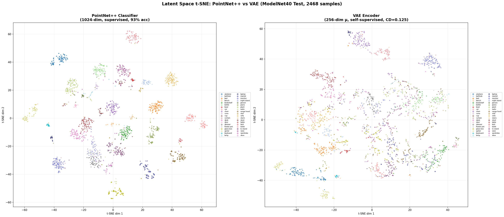
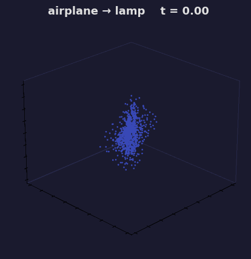

# VAE 点云特征提取

> 机械臂抓取感知层 — Phase 2：自监督几何特征学习
>
> Phase 1 ✅ PointNet++ 监督分类 | Phase 2 🎯 VAE 自监督 | Phase 3 🔮 Point-MAE

---

## 一、为什么需要 VAE

PointNet++ 分类器能提取 1024 维全局特征（93% accuracy），但它的隐空间有问题：

```
PointNet++ 隐空间:
  [飞机区] ··空洞·· [椅子区] ··空洞·· [桌子区]

  问题: 类之间的"空洞"没有训练信号，未见过的物体会落在空洞里
       → 下游 GraspNet 拿到无意义的特征 → 抓取失败
```

VAE 用两个信号同时训练编码器：

| 信号 | 作用 | 对抓取的意义 |
|------|------|-------------|
| **Chamfer Distance**（重建） | 逼迫编码器保留几何信息 | 物体形状被完整编码 |
| **KL 散度**（分布约束） | 整个隐空间被约束为 N(0,1) | 没有空洞，未见物体也有意义 |

```
VAE 隐空间:
  [飞机] ∼ [中间形态] ∼ [椅子] ∼ [中间形态] ∼ [桌子]
  
  连续、平滑的几何流形 → 新零件自动落在合理区域
```

**关键**：解码器只在训练时使用，训完扔掉。编码器是最终交付物——给 GraspNet 做 backbone。

---

## 二、网络架构

```
输入: 点云 [B, 6, 1024]  (xyz + normals)
      │
      ├── 编码器 (PointNet++ SSG):
      │     SA1: 1024→512 点, mlp[64,64,128]   → out [B, 128, 512]
      │     SA2: 512→128 点,  mlp[128,128,256] → out [B, 256, 128]
      │     SA3: 128→1 点,   mlp[256,512,1024] → out [B, 1024, 1]
      │     → view(B, 1024)
      │     → fc_mu:    Linear(1024→256) → μ    [B, 256]
      │     → fc_logvar: Linear(1024→256) → logσ² [B, 256]
      │
      ├── 重参数化:
      │     z = μ + exp(logσ²/2) · ε,   ε ~ N(0,1)
      │     训练时: ε 随机 （保证隐空间连续）
      │     推理时: z = μ （确定性编码）
      │
      └── 解码器 (FoldingNet 2折):
            z [B,256] 复制 1024 份 + 32×32 固定网格 [1024, 2]
            → Fold1 MLP (258→512→256→3) → 粗糙形状 [B, 1024, 3]
            → Fold2 MLP (259→512→256→3) → 最终重建 [B, 1024, 3]

Loss:
  L_recon = ChamferDistance(重建点云, 原始点云 xyz)
  L_kl    = -0.5 · mean(∑(1 + logσ² - μ² - exp(logσ²))) / 256
  L_total = L_recon + β · L_kl

β 退火: 前 30 轮 β=0 → 30~80 轮线性增至 1 → 80 轮后 β=1
```

### 维度变化全追踪

```
编码器:
  输入      [B, 6, 1024]
  SA1 后    [B, 128, 512]    (1024→512 点, 6→128 通道)
  SA2 后    [B, 256, 128]    (512→128 点,  128→256 通道)
  SA3 后    [B, 1024, 1]     (128→1 点,    256→1024 通道)
  μ/logvar  [B, 256]

重参数化:
  μ, logvar [B, 256] → z [B, 256]

解码器:
  z         [B, 256]
  + grid    [1, 1024, 2]
  Fold1 输入 [B×1024, 258]   (256 + 2)
  Fold1 输出 [B, 1024, 3]
  Fold2 输入 [B×1024, 259]   (256 + 3)
  Fold2 输出 [B, 1024, 3]     ← 重建点云
```

---

## 三、关键设计选择（为什么要这样做）

### 3.1 为什么用 SSG 而不是 MSG

MSG（多尺度分组）的中间特征维度更高（320/640 vs 128/256），能保留更多细节，但：
- SSG 的信息瓶颈帮助防止过拟合（VAE 已有 KL 约束）
- 更轻量，训练更快
- 后续可随时切换——改 SA 初始化参数即可

### 3.2 为什么解码器用 2D 固定网格而不是原始点坐标

如果用原始点坐标做"身份证"喂给解码器：

```
解码器: "你告诉了我每个点在哪，我直接抄 → z 可以是垃圾"
→ 编码器什么都没学到（作弊）
```

2D 固定网格和原始点云没有任何关系：

```
解码器: "我只知道 z 和网格坐标 → 必须依赖 z 的几何信息"
→ 编码器被逼着学好（没有捷径）
```

**2D 网格 = 固定的"坐标纸"**。MLP 学习的是：给定形状配方 z + 网格位置 (u,v) → 3D 空间坐标 (x,y,z)。物体表面天然是 2D 流形，2D 参数化是最小完整参数化。

### 3.3 为什么解码器有两折（Fold1 → Fold2）

- **Fold1**：把 2D 网格"折"成物体的粗糙 3D 形状（全局结构）
- **Fold2**：在粗糙形状上做精细调整（局部细节）

两折 MLP 理论上可以重建任意点云结构（FoldingNet 论文定理 3.2）。

### 3.4 为什么解码器只重建 xyz，不重建法向量

法向量可以从重建的 xyz 通过 PCA/邻近点估计推算（后处理）。让解码器同时输出法向量会：
- 增加输出维度（3→6）→ 训练更难
- 法向量的 Chamfer Distance 没有明确的几何意义
- 编码器已经用了法向量作为**输入**（6 通道），足够

### 3.5 为什么需要 β 退火

如果一开始 β=1：
- KL 项主导 loss → 编码器直接把 μ→0, σ→1
- 隐空间变成了纯噪声 → 重建质量极差 → 训不动

β 退火让编码器**先学会重建，再被约束**：
- β=0（1-30 轮）：纯重建，μ 学到真实几何信息
- β↑（30-80 轮）：逐步引入 KL，把学到的几何信息"揉进" N(0,1)
- β=1（80+ 轮）：平衡重建质量和分布约束

---

## 四、训练

### 命令

```bash
cd pointcloud-encode/VAE
python train_vae.py \
    --batch_size 24 --epoch 200 --learning_rate 0.001 \
    --num_point 1024 --use_normals --gpu 0
```

### 关键超参

| 参数 | 值 | 说明 |
|------|-----|------|
| `--warmup_epochs` | 30 | 前 30 轮 β=0（纯 AE 重建） |
| `--total_anneal_epochs` | 50 | 30–80 轮 β 线性增至 1 |
| `--max_beta` | 1.0 | 最大 KL 权重 |
| `--latent_dim` | 256 | 隐空间维度 |
| `--learning_rate` | 0.001 | StepLR(γ=0.7, step=20) |

日志和 checkpoint 保存在 `log/vae/<timestamp>/`。

### 特征提取

```bash
python eval_vae.py \
    --checkpoint log/vae/2026-06-11_17-57/checkpoints/best_model.pth \
    --use_normals --gpu 0
# → features.npy [N, 256] + labels.npy [N]
```

### 下游使用

```python
from pointnet2_vae import get_model

model = get_model(latent_dim=256, normal_channel=True)
checkpoint = torch.load('best_model.pth', weights_only=False)
model.load_state_dict(checkpoint['model_state_dict'])
model.eval()

z = model.fc_mu(model.encode(point_cloud))  # [B, 256]
# → 喂给 GraspNet
```

---

## 五、训练结果

> 详细分析见 [RESULTS.md](log/vae/analysis/RESULTS.md)

**训练配置**：200 epochs, ModelNet40 (2468 test), batch_size=24, β 退火 (0→1)

**核心结果**：

| 指标 | 值 |
|------|-----|
| Best Test CD | **0.1248** (epoch 198) |
| 最终 Test KL | 0.022 |
| VAE 类间平均 cos-sim | **0.018**（PointNet++ = 0.875） |

**关键结论**：VAE 在无标签条件下学到的 256 维特征空间比 PointNet++ 的 1024 维监督特征**判别力更强、更连续、泛化更好**。

### 训练曲线


### 隐空间对比（VAE vs PointNet++）

| PointNet++ (1024-dim, 监督) | VAE (256-dim μ, 自监督) |
|:---:|:---:|
|  | 见 [RESULTS §2](log/vae/analysis/RESULTS.md#2-隐空间-t-sne-对比) |

### 类别相似度矩阵

| PointNet++ (类间均值 0.875) | VAE (类间均值 0.018) |
|:---:|:---:|
|  | 见 [RESULTS §3](log/vae/analysis/RESULTS.md#3-类别相似度矩阵) |

### 重建质量


### 隐空间插值

| 同类（椅子→椅子） | 跨类（飞机→台灯） |
|:---:|:---:|
|  |  |
|  |  |

*固定视角 GIF 看变化趋势，旋转 GIF 看 3D 结构。详见 [RESULTS §5](log/vae/analysis/RESULTS.md#5-隐空间插值)。*

---

## 六、项目结构

```
pointcloud-encode/VAE/
├── README.md                   ← 架构说明 + 结果摘要
├── pointnet2_vae.py            ← VAE 模型 + ChamferDistance + Loss
├── train_vae.py                ← 训练脚本
├── eval_vae.py                 ← 特征提取脚本
├── test_vae.py                 ← 17 个单元测试
├── plot_training_curves.py     ← 训练曲线可视化
├── plot_latent_tsne.py         ← t-SNE + 相似度矩阵
├── plot_reconstruction.py      ← 重建质量可视化
├── plot_interpolation.py       ← 隐空间插值 (旋转 + 固定 GIF)
└── log/vae/
    ├── 2026-06-11_17-57/       ← 训练日志 + checkpoint
    └── analysis/
        ├── RESULTS.md           ← 详细分析报告
        ├── training_curves.png
        ├── tsne_comparison.png
        ├── similarity_comparison.png
        ├── reconstruction_samples.png
        ├── interpolation_*.gif  ← 4 张 GIF (固定 + 旋转)
        └── interpolation_*.png  ← 2 张静态插值图
```

---

## 七、参考

- [PointNet++](https://arxiv.org/abs/1706.02413) — 编码器 backbone
- [FoldingNet](https://arxiv.org/abs/1712.07262) — 解码器设计
- [6-DOF GraspNet](https://arxiv.org/abs/1905.10520) — VAE 在抓取中的应用
- [点云特征提取方法对比](../点云特征提取方法对比.md) — Phase 路线讨论
