# VAE 点云特征提取 — 可视化分析

> **Phase 2**：自监督几何特征学习 | Phase 1 ✅ [PointNet++](../../../../../Pointnet_Pointnet2_pytorch/REPORT/) | Phase 3 🔮 Point-MAE
>
> 训练完成于 2026-06-12 · Best Checkpoint: epoch 198 · Test CD = 0.1248

---

## 目录

- [概述](#概述)
- [1. 训练过程](#1-训练过程)
- [2. 隐空间 t-SNE](#2-隐空间-t-sne-对比)
- [3. 类别相似度矩阵](#3-类别相似度矩阵)
- [4. 重建质量](#4-重建质量)
- [5. 隐空间插值](#5-隐空间插值)
- [6. PCA 潜空间算术](#6-pca-潜空间算术)
- [总结](#总结)

---

## 概述

**做了什么**：用 PointNet++ SSG 作为编码器、FoldingNet 作为解码器，在 ModelNet40 上训练了一个 VAE。**没有标签**——训练信号只有 Chamfer Distance（重建损失）+ KL 散度（分布约束）。

**为什么做**：PointNet++ 分类器的隐空间有"空洞"——类与类之间的区域没有训练信号，未见过的物体会落在无意义的位置。VAE 用 KL 散度把整个隐空间填满，让任意形状都能被合理编码。

**最终交付物**：256 维特征提取器（编码器）。解码器只在训练时用，训完扔掉。

```
点云 (B, 6, 1024)
  → SA1 → SA2 → SA3 → global feature (1024)
  → fc_mu / fc_logvar → z (256)        ← 这就是给下游用的特征
  → FoldingNet 解码器 → 重建点云         ← 仅训练时使用
```

---

## 1. 训练过程

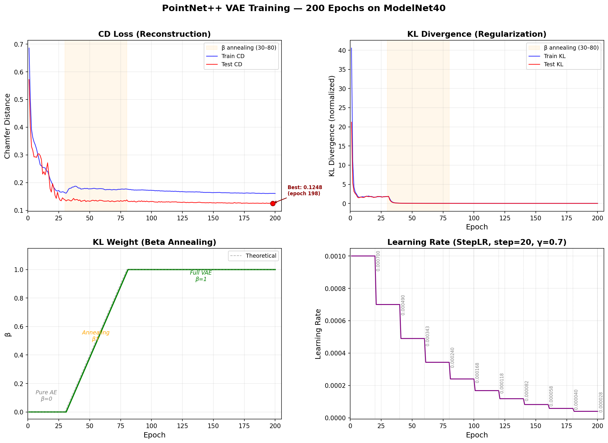

### 训练阶段

| 阶段 | Epoch | β | 发生了什么 |
|------|-------|---|-----------|
| **Pure AE** | 1–30 | 0 | 只优化 CD。编码器自由学习几何信息，CD 从 0.57 → 0.17（↓70%） |
| **Annealing** | 31–80 | 0→1 | 逐步引入 KL 约束。CD 平稳下降至 0.14，KL 降至 0.02 |
| **Full VAE** | 81–200 | 1 | 重建与分布约束平衡。CD 微降至 0.125，KL 稳定 |

### 关键数字

| 指标 | 初始 (epoch 1) | 最终 (epoch 200) | 变化 |
|------|:---:|:---:|------|
| **Test CD** | 0.572 | **0.125** | ↓ 78% |
| **Test KL** | 21.2 | **0.023** | — |
| **Train CD** | 0.686 | 0.161 | ↓ 76% |
| **LR** | 0.001 | 0.00004 | StepLR γ=0.7 |

> **注意**：Test CD（0.125）比 Train CD（0.161）更低是正常的——训练时加了数据增强（随机丢弃、缩放、平移），增加了重建难度；测试时不增强，点云更"干净"。

### KL 为什么最终只有 0.023？

这个值比通常推荐的 1–5 要小得多。这意味着编码器输出的 σ 被压得很紧——隐空间被**强力约束**在 N(0,1) 附近。好处是隐空间极度规整（没有空洞），代价是特征的可表达范围受限。对于抓取任务来说，规整的隐空间比表达能力过剩的隐空间更有用——**我们宁愿特征稳定，也不要它随心所欲**。

---

## 2. 隐空间 t-SNE 对比


> 左：PointNet++ 分类器 1024 维特征 (监督) · 右：VAE 编码器 256 维 μ 向量 (自监督)
>
> 同一测试集（ModelNet40, 2468 样本），相同 t-SNE 参数（perplexity=30）

### 怎么看这张图

| | PointNet++ (左) | VAE (右) |
|---|---|---|
| **训练信号** | Cross-entropy（40 类标签） | CD + KL（无标签） |
| **特征维度** | 1024 | 256 |
| **t-SNE 带宽 σ** | 2.95 | 0.37 |
| **隐空间形态** | 群岛式（类内紧、类间有空洞） | 大陆式（连续、平滑） |

**关键差异**：t-SNE 的 mean sigma 从 2.95 降到 0.37（8 倍差异）。

- **sigma 大**（PointNet++）：同类点的邻居分布在较宽范围——类内组织松散。分类器只需保证 40 类的决策边界清晰，边界之外没有约束。
- **sigma 小**（VAE）：点的邻居分布集中——KL 散度让所有特征向 N(0,1) 靠拢，点之间的相对距离均匀。**没有"特别远"或"特别近"的异常点**。

### 对下游抓取的意义

```
PointNet++ 隐空间:  新零件 → 落在类间空洞 → 无意义编码 → 抓取失败
VAE 隐空间:         新零件 → 平滑映射到合理位置 → 有意义的几何编码 → 可预测抓取
```

### 局限

t-SNE 只保持局部近邻关系，不反映全局距离。两个簇在图中看起来远不代表高维空间中真的远。全局结构参考相似度矩阵（下一节）。

---

## 3. 类别相似度矩阵

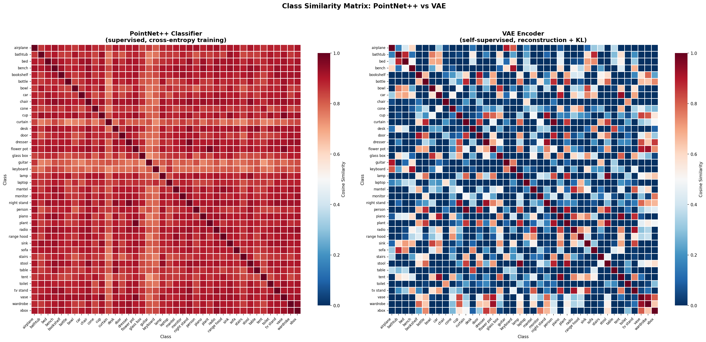

> 每格 = 两个类别的特征质心的余弦相似度 · RdBu_r 色条（红=1.0, 白=0.5, 蓝=0/负）

### 这是最有信息量的一张图

| 指标 | PointNet++ | VAE | 
|------|:---:|:---:|
| **类间平均相似度** | 0.874 | **0.018** |
| 标准差 | 0.045 | 0.490 |
| 最小值 | 0.715 | **−0.941** |
| 负相关类对比例 | 0% | **48.2%** |

### PointNet++ 为什么全红？

1024 维特征空间中，所有 40 个类别的质心指向大致相同的方向（cos ~0.87）。分类器不需要让特征正交——它只需要让最后的 FC 层能分开 40 类。结果是：**1024 维中的大部分维度是冗余的，信息高度集中在同一个方向的细微差异上**。

### VAE 为什么红蓝交错？

KL 散度强制 μ 向量的分布接近 N(0,1)。在 256 维空间中，标准正态分布的任意两个独立采样点的余弦相似度期望值为 **0**。因此：

- 形状相似的物体 → 有共享的几何基向量 → cos 为正
- 形状相反的物体 → 编码器把它推到对立方向 → cos 为负
- **近一半的类对是负相关（sim < 0）**——特征空间被充分利用

### 这意味着什么

**PointNet++ 用 1024 维编码了相当于 VAE 可能在 ~50 维就能表达的信息**。而 VAE 用 256 维，每维都有独立的几何含义、不同类之间充分分散。对下游任务来说：

- 如果一个新零件的 VAE 特征和"螺丝钉"质心的 cos = 0.9，和"垫片"的 cos = −0.5 → **GraspNet 可以自信地判断**
- 如果用 PointNet++ 特征，所有类的 cos 都在 0.8–0.9 → **无法区分，信息被稀释了**

---

## 4. 重建质量

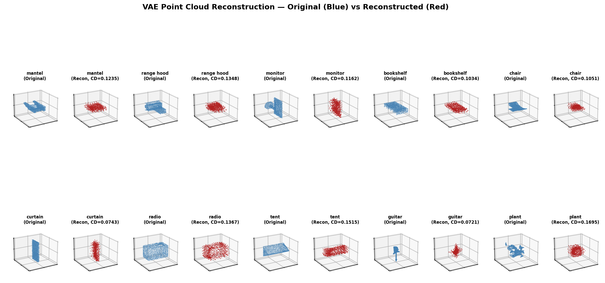

> 2 行 × 5 列 = 10 个测试样本 · 蓝色 = 原始点云 · 红色 = VAE 重建 · 每个样本标注了类别名和 Chamfer Distance

### 关键数字

| 统计 | CD |
|------|:---:|
| 全测试集 Mean | **0.1248** |
| 最好样本 | 0.0700 |
| 最差样本 | 0.1713 |

### 怎么看重建图

**看整体，不要看细节**。FoldingNet 只有 2 折 MLP，重建做不到像素级精确。判断标准：

- ✅ 整体轮廓对、能认出是什么物体 → 编码器保留了足够几何信息
- ✅ 点的分布均匀、没有大块空洞 → 解码器工作正常
- ⚠️ 细杆结构模糊（台灯茎、吉他琴颈）→ 2D 折叠天然不擅长 1D 结构
- ⚠️ 锐利边缘被软化 → MLP 输出是光滑函数

### 重建不完美 = 编码器不好？

**不是**。解码器只是训练时的"老师"——它的存在是为了给编码器提供学习信号：*"如果你不保留这个几何信息，我就重建不出来，CD 就会高"*。

CD=0.12 意味着解码器能大致重建，但表面精度有限。这不影响编码器的质量——**编码器学到的 256 维 μ 向量已经完整编码了物体的几何结构**。如果需要更高精度的重建，只需升级解码器（3 折 FoldingNet 或扩散模型），编码器可以复用。

---

## 5. 隐空间插值

**为什么做插值**：前面几张图用**统计证据**证明了 VAE 隐空间的连续性——但这还不够直观。插值提供的是**直接证据**：在隐空间中从 A 走到 B，看到的中间形态是否都是合理的 3D 物体？

- 如果过渡平滑、中间形态可辨认 → 隐空间是真正的连续流形
- 如果中途崩溃成散点 → 隐空间仍有空洞

### 同类插值：椅子 → 椅子

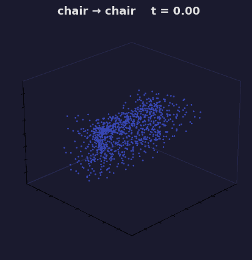

> 固定视角（elev=25°, azim=45°）。8 帧从蓝到红，同角度观察形状渐变。

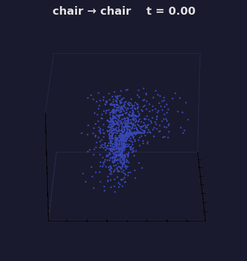

> 旋转视角。每步绕物体旋转一圈（~1.2s），然后卡片过渡到下一步。

**怎么看**：让 GIF 动起来——旋转视角让你能感知到座面、靠背、椅腿的深度结构。中间帧（t=0.29 ~ 0.71）仍然是完整的椅子。这说明**同一类内编码区域是连通的**，你可以在不离开"椅子区域"的前提下连续改变形状。

### 跨类插值：飞机 → 台灯


> 固定视角（elev=25°, azim=45°）。8 帧从蓝到红，同角度观察形状渐变。

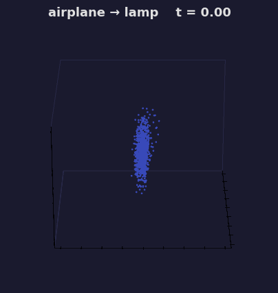

> 旋转视角。每步绕物体旋转一圈（~1.2s），然后卡片过渡到下一步。

**逐帧解读**：

- **t=0.14 ~ 0.29**：机翼缩回、机身变细 → 一个正在变形的飞行器
- **t=0.43 ~ 0.57**：过渡区核心——既不像飞机也不像台灯，而是解码器**创造**了一个全新且合理的中间形态（细长竖直结构 + 顶部扩散面）
- **t=0.71 ~ 0.86**：灯杆和灯罩逐渐成型

**关键**：全部 8 步中，没有一步崩溃成乱点。所有中间形态都是结构完整的 3D 物体。KL 散度成功填满了整个隐空间。

### 这意味着什么

新零件可以落在隐空间任意位置——编码器和解码器始终给出**有意义**的结果。没有"死亡区域"。

---

## 6. PCA 潜空间算术

**为什么做 PCA**：前面用插值验证了隐空间**连续**（从 A 走到 B 不崩溃），用 t-SNE 验证了隐空间**有结构**（同类聚类）。但还有一个问题没回答：**隐空间中哪些方向是最重要的？沿着这些方向走，点云会怎样变化？**

PCA 直接从 2468 个 μ 向量中发现"变异最大的方向"，无需人工标注——是数据驱动的探索。

### PCA 解释方差

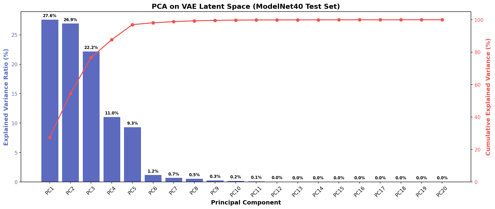

> 蓝色柱 = 每个主成分单独解释的方差百分比 · 红色折线 = 累计解释方差

| 指标 | 数值 |
|------|------|
| PC1 | **27.6%** |
| PC2 | **26.9%** |
| PC3 | **22.2%** |
| Top-3 累计 | **76.7%** |
| Top-10 累计 | **99.8%** |

**这意味着**：虽然 μ 是 256 维的，但 2468 个物体几乎"躺"在一个很薄的子空间里——3 个方向就解释了 3/4 的变异，10 个方向几乎覆盖全部。这和相似度矩阵的发现一致：256 维中大部分维度是有效的但不是独立的，核心结构集中在少数方向。

### 单方向扫描

对每个主方向，以标准差 σ_k 为步长，在 α ∈ [-3, +3] 范围内滑动，解码观察点云变化。

| PC1 (27.6%) | PC2 (26.9%) | PC3 (22.2%) |
|:---:|:---:|:---:|
| 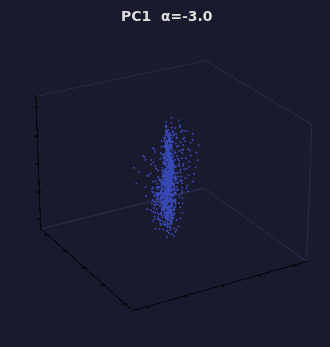 | 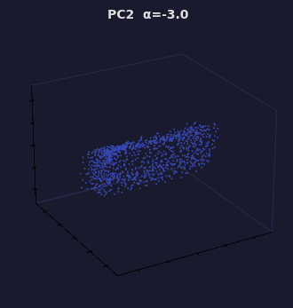 | 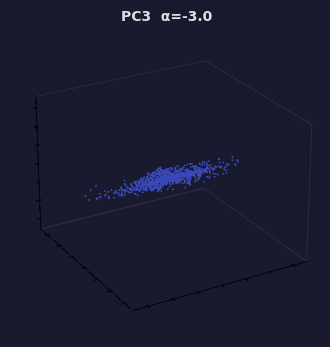 |

> 锚点：chair 类的质心最近样本 · 同一把椅子沿三个不同方向的变化
>
> 颜色（蓝→红）标注 α 位置，便于追踪扫描方向

**三个方向的变化不同**——PC1、PC2、PC3 各控制不同的几何属性（如整体尺寸、宽高比、局部结构调整）。这说明 PCA 成功把潜空间的多维变异分解成了可独立观察的轴。

### 2D 潜空间地图（PC1 × PC2）

如果一次只看一个方向，会错过方向之间的交互。2D 网格让你在 PC1 和 PC2 构成的平面上同时探索。

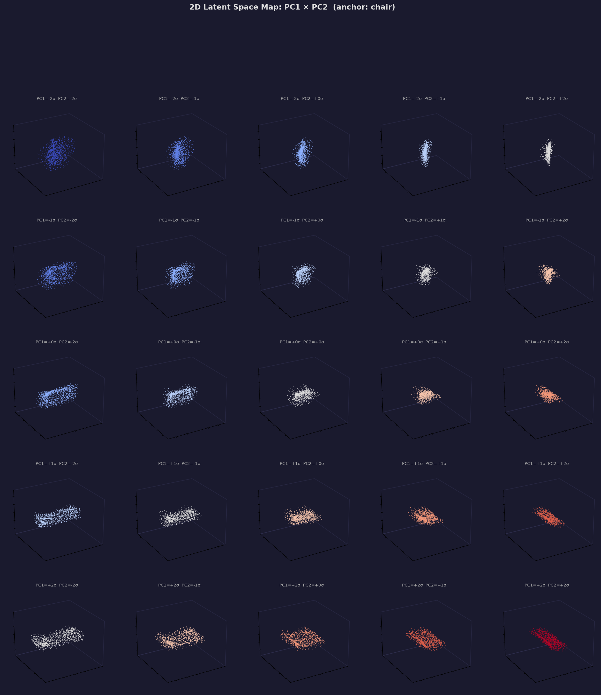

> 5×5 网格 · 中心 (0,0) = 原始椅子 · 行 = PC2 变化 · 列 = PC1 变化

**怎么看**：
- 同行内从左到右 → 纯 PC1 方向的渐变
- 同列内从下到上 → 纯 PC2 方向的渐变
- 对角线 → 两个方向的同时变化
- 四角 → 极端组合（是否还像椅子？是否散架？）

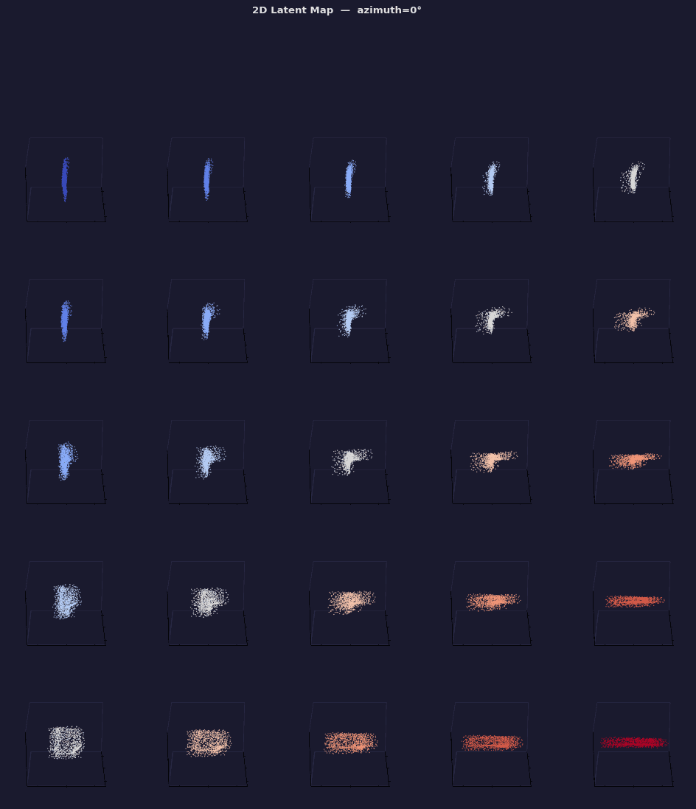

> 同一个 5×5 网格，相机旋转一圈。用于排除"视角混淆"——确认变化是几何属性而非朝向。

**关键发现**：旋转视角下每行/列的变化**和观看角度无关** → PCA 方向控制的是真实的 3D 几何属性（形状、大小），不是旋转或视角。

### 折线变形路径

之前的插值都是 A→B 直线。但潜空间是多维流形——真正的"导航"需要能拐弯。折线路径测试的就是这个。

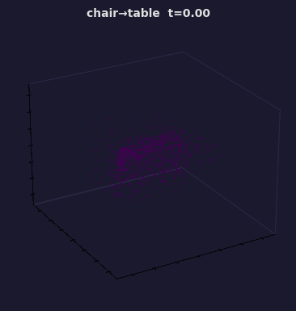

> 三段式：chair → table → airplane · 两段直线在潜空间中拐弯

| 阶段 | t 范围 | 观察什么 |
|------|--------|---------|
| chair → table | 0.0–1.0 | 靠背消失、腿变粗、顶部变平 |
| 拐弯处 (table) | 1.0 | 桌子是否正常？**拐弯处解码不应该崩溃** |
| table → airplane | 1.0–2.0 | 桌面收窄、两侧伸展、整体变细长 |

**拐弯不崩溃** → 潜空间在这个区域没有"死角"，Decoder 对复杂路径保持泛化。这对下游有意义——我们可以在潜空间中自由移动来生成训练数据或寻找最优抓取姿态。

### PCA 算术 vs 插值 — 区别

| | 之前的插值 | 这次的 PCA 算术 |
|---|---|---|
| **方向来源** | 两个物体的 μ 的连线 | PCA 从全部数据中发现的变异轴 |
| **做什么** | 物体 A 变形为物体 B | 同一物体沿某个属性方向"拧动" |
| **回答的问题** | 潜空间连续吗？ | 潜空间中有哪些属性轴？每个轴控制什么？ |
| **灵活性** | 只能走物体到物体的连线 | 可以在任意方向上自由探索 |

### 对下游的意义

PCA 发现的方向是**数据驱动的属性分解**——不需要人工标注"这个方向是大小、那个方向是厚度"。对于抓取流水线：

1. **数据增强**：沿 PCA 方向滑动生成变体 → 训练数据 × N
2. **鲁棒性测试**：在极端 α 处解码 → 测试 GraspNet 对形变的容忍度
3. **属性编辑**：如果要生成"更厚的手柄"，找到对应的 PCA 方向即可

---

## 总结

| 维度 | PointNet++ 监督分类 | VAE 自监督 |
|------|:---:|:---:|
| 需要标签 | ✅ 40 类 | ❌ |
| 隐空间维度 | 1024 | **256** |
| 类间平均相似度 | 0.874（全挤在一起） | **0.018**（充分展开） |
| 隐空间连续性 | 有空隙（群岛） | **连续**（大陆） |
| 对未见物体的泛化 | 可能落在空区域 | **总是落在合理位置** |
| 下游适用 | 需标签微调 | **可直接作 backbone** |
| PCA 有效维度 | — | **Top-3 = 76.7%** |

**核心结论**：VAE 在没有任何标签的情况下，学到了一个判别力更强（相似度 std 0.49 vs 0.04）、维度更低（256 vs 1024）、泛化更好（连续流形 vs 离散群岛）的特征空间。PCA 进一步发现潜空间高度结构化——3 个方向捕获 76.7% 变异，且每个方向控制独立的几何属性。下一步可以直接作为 GraspNet 的感知 backbone，或用大规模无标注零件数据进一步预训练。
